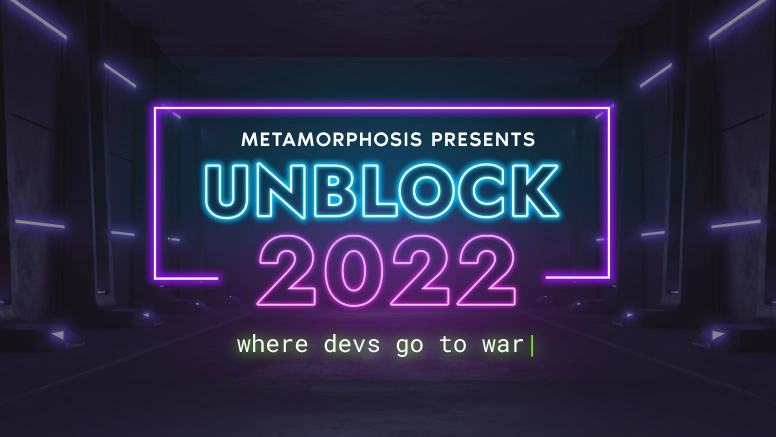

# Phala x Unblock Hackathon 2022

## Introduction

On this page, you will find everything you need to participant in the Phala bounties in the [Unblock Hackathon](https://unblock.devfolio.co/) event.

[Phala Network](https://www.phala.network/) is a Kusama/Polakdot parachain focusing on trustless cloud computing, based on [Secure Enclave](https://sgx101.gitbook.io/sgx101/sgx-bootstrap/overview) technology. Phala has its unique programming model [Phat Contract](https://wiki.phala.network/en-us/build/general/intro/), which is running in the off-chain workers. The Phat Contract is meant to be the missing computation unit for the existing smart contracts. It provides:
- Privacy-preserving with performance. It’s safe to store and process your secret data in Phat Contract since it’s backed by hardware-based encryption throughout its lifecycle;
- Zero latency, zero gas fee. The interactions with Phat Contract can involve no on-chain transactions, thus achieving millisecond-level read and write responses with no gas fee;
- Connectivity with HTTP requests. Phat Contract natively supports HTTP requests. Use it to connect any existing Web2 services to store data and build Oracle, or an RPC node of other blockchains for easy and safe cross-chain operations;
- Freedom to use libraries in Rust ecosystem. Write your contract with Rust-based [ink!](https://github.com/paritytech/ink) language and use libraries with no_std support. We will support std in the future Phat Contract version then you can use any libraries you like.

## 📅 Dates

- [Registration](https://unblock.devfolio.co/): 2022.11.1 - 2022.11.10
- Start Hacking: 2022.11.10
- Duration: 7 days
- End of Hackathon: 2022.11.18
- Announcement of Winners: 2022.11.25 in our [Discord server](https://discord.com/invite/phala) and [Twitter](https://twitter.com/PhalaNetwork)

## ✍️ Submissions

You need to submit your solutions as an [issue to this repo](https://github.com/Phala-Network/Unblock-Hackathon-2022/issues) following the issue template. The submission templates will be provided after the hack starts.

## 💬 Developer Resources
- [Phala Hackathon Submission Repo](https://github.com/Phala-Network/Unblock-Hackathon-2022/)
- [Phala Wiki](https://wiki.phala.network/en-us/build/general/intro/)
- [Phat Contracts UI](https://phat.phala.network/)
- [Phala Network GitHub](https://github.com/Phala-Network)
- [Awesome Phat Contracts](https://github.com/Phala-Network/awesome-phat-contracts)
- [Dev Phase](https://github.com/l00k/devphase) - Development tool provided from a community contribution
- Ideas from [previous Hackathon Submissions](https://github.com/Phala-Network/Encode-Hackathon-2021/issues/21)

## 💰 Hackathon Bounties

### Challenge #1

| Bounty  | Winners  |
| ------- | -------- |
| 500 PHA | First 50 |

Complete the [Oracle Workshop](https://github.com/Phala-Network/oracle-workshop) steps for the Beginner and Advanced Challenge. Phat Contracts are different than the typical EVM Smart Contract. In contrast, Phat Contracts are written in the Rust-based eDSL [ink!](https://paritytech.github.io/ink/) and compile down to WASM. Walking through this workshop and getting some hands on experience here will show you the basics of building an Oracle with cross-contract calls that can be valuable for entering into Challenge #2.

### Challenge #2

| 1st   | 2nd  | 3rd  | plus (all in PHA)                  |
| ----- | ---- | ---- | ---------------------------------- |
| 10000 | 7000 | 3500 | 1500 for each qualified submission |

Build a fully functional dApp with Phat Contract on Phala Testnet.

A qualified dApp should be useful to solve some real-world problems or bring fun to people. It should also utilize the unique features of Phala (privacy-preserving, computation-intensive, or with HTTPS requests).

#### **In addition, documentation and tutorial contributions are elegible to our [Bounty Program](https://github.com/Phala-Network/bounty-program).**

The contribution can be:

- Fixes or improvements on our [wiki repo](https://github.com/Phala-Network/phala-wiki-next)
- Published video tutorials on Youtube and Twitter (please submit an issue in the Code Bounty Program repo)
- Documentation or bug fixes in our [main repo](https://github.com/Phala-Network/phala-blockchain) or [JS SDK](https://github.com/Phala-Network/js-sdk)

## 💬 Chat and Support

Meet friends and the Phala team at our [Official Discord Server](https://discord.gg/nJaehCD98Y)!

If you have any questions about the hackathon, Phala development, or you want to report a bug, we have a **#hackathon** group dedicated to that.

## About Phala Network

[Phala Network](https://phala.network/) is a Web3.0 computing cloud that supports data privacy while remaining trustless. Unlike centralized cloud service, Phala doesn’t own any server or data center. Anyone can provide permissionless servers into Phala Network, and because of a clever combination of blockchain and secure enclave, we can make sure the servers can’t be evil even when they are in an edge network situation. Together, this creates the infrastructure for a powerful, secure, and scalable trustless computing cloud.

Some useful resources include:
- [Main page](https://phala.network/)
- [Phala Wiki](https://wiki.phala.network/en-us/build/general/intro/)
- [Discord channel](https://discord.gg/myBmQu5) and [Forum](https://forum.phala.network/) to discuss with us and our community members directly
- [Medium](https://medium.com/phala-network) and [Twitter](https://twitter.com/PhalaNetwork) to learn about our latest progress
